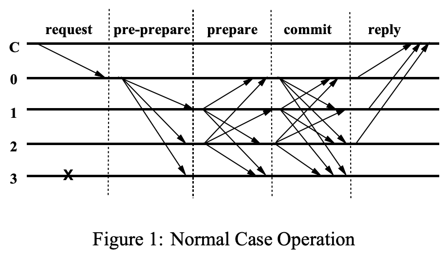

# notekook
## Introduction

Record some tips when learning or thinking.

* [Code Language](#Code-Language)
    * [Rust](#Rust)
        * [Docs](#Docs)
        * [Types](#Types)
            * [Rc](#Rc)
            * [Arc](#Arc)
            * [Mutex](#Mutex)
            * [Ord](#Ord)
            * [Duration](#Duration)
            * [channel](#channel)
            * [traitObj](#traitObj)
            * [trait](#trait)
                * [Send](#Send)
                * [Sync](#Sync)
        * [Memory](#Memory)
        * [Async rust](#Async-rust)
            * [Async vs other concurrency models](#Async-vs-other-concurrency-models)
            * [The State of Async rust](#The-state-of-async-rust)
            * [Future trait](#Future-trait)
            * [Task-Waker-Executor](#Task-Waker-Executor)
            * [Async IO Example](#Async-IO-Example)
            * [Third part lib](#Third-part-lib)
                * [tokio](#tokio)
                * [futures](#futures)
                * [mio](#mio)
        * [FFI](#FFI)
        * [Error Handle](#Error-Handle)
            * [backtrace](#std-backtrace)
            * [anyhow](#anyhow)
        * [Databases](#Databases)
            * [diesel](#diesel)
            * [sqlite](#sqlite)
            * [sqlx](#sqlx)
        * [NetWork](#Network)
            * [request](#request)
            * [http](#http)
        * [Web](#Web)
            * [active-web](#active-web)
            * [axum](#axum)
        * [Cargo tools](#Cargo-tools)
            * [cargo fmt](#cargo-fmt)
            * [cargo clippy](#cargo-clippy)
            * [cargo expand](#cargo-expand)
    * [Golang](#Golang)
    * [JavaScript](#JavaScript)
        * [Docs](#JsDocs)
* [Computer System](#Computer-System)
    * [System call](#System-call)
    * [Synchronous](#Synchronous-between-multiple-thread)
* [Design Pattern](#Design-Pattern)
    * [Object-oriented programming design patterns](#GoF's-Object-oriented-programming-design-patterns)
    * [Concurrent programming design pattern](#Concurrent-programming-design-pattern)
* [Block chain](#Block-chain)
    * [Consensus](#Consensus)
    * [Contract](#Contract)
        * [WebAssembly](#WebAssembly)
    * [Virtual Machine](#Virtual-Machine)
    * [Transaction](#Transaction)
    * [Storage](#Storage)
    * [Network](#Network)
    * [Cryptography](#Cryptography)
* [Database](#Database)
    * [SQLite](#SQLiteDB)
* [Shell Script](#Shell-Script)
* [Makefile](#Makefile)
* [Reading notes](#Reading-notes)
* [Miscellaneous(杂项)](#Miscellaneous)
## Code Language
### Rust
* Why choice rust
    * Performance:
        * Rust is blazingly fast and memory-efficient: with no runtime or garbage collector, it can power performance-critical services, run on embedded devices, and easily integrate with other languages.
    * Reliability:
        * Rust’s rich type system and ownership model guarantee memory-safety and thread-safety — enabling you to eliminate many classes of bugs at compile-time.
    * Productivity:
        * Rust has great documentation, a friendly compiler with useful error messages, and top-notch tooling — an integrated package manager and build tool, smart multi-editor support with auto-completion and type inspections, an auto-formatter, and more.
* Advantages of Rust 
    * RAII
    * ownership
    * borrow check
    * thread safety
    * Zero Cost Abstractions
#### Docs
* [Rustlang official](https://www.rust-lang.org/)
* The Rust Programming Language
    * [En-Us](https://doc.rust-lang.org/book/)
    * [Zh-Cn](https://kaisery.github.io/trpl-zh-cn/)
* [macros book](https://danielkeep.github.io/tlborm/book/README.html)
* Protobuf
    * [protobuf guide](https://colobu.com/2015/01/07/Protobuf-language-guide/)
    * [Rust Protocol Buffers](https://juejin.cn/post/6844903878480117767)
* [Rust Design Patterns](https://rust-unofficial.github.io/patterns/intro.html)
* [The Rust Reference](https://doc.rust-lang.org/reference/introduction.html)
#### Types
##### Rc
* Rc
    * A single-threaded reference-counting pointer.
    * Declaration
    ```rust
  pub struct Rc<T: ?Sized> {
      ptr: NonNull<RcBox<T>>,
      phantom: PhantomData<RcBox<T>>,
  }
  impl<T: ?Sized> Clone for Rc<T> {
      #[inline]
      fn clone(&self) -> Rc<T> {
          self.inner().inc_strong();
          Self::from_inner(self.ptr)
      }
  }
  unsafe impl<#[may_dangle] T: ?Sized> Drop for Rc<T> {
      fn drop(&mut self) {
          unsafe {
              self.inner().dec_strong();
              if self.inner().strong() == 0 {
                  // destroy the contained object
                  ptr::drop_in_place(Self::get_mut_unchecked(self));
  
                  // remove the implicit "strong weak" pointer now that we've
                  // destroyed the contents.
                  self.inner().dec_weak();
  
                  if self.inner().weak() == 0 {
                      Global.deallocate(self.ptr.cast(), Layout::for_value(self.ptr.as_ref()));
                  }
              }
          }
      }
  }
    ```
##### Arc
* A thread-safe reference-counting pointer. ‘Arc’ stands for ‘Atomically Reference Counted’.
##### Mutex
* A mutual exclusion primitive useful for protecting shared data
##### RwLock
* A reader-writer lock
##### channel
* oneshot::channel
    * futures::sync::oneshot::channel
    * Signature
    ```rust
  pub fn channel<T>() -> (Sender<T>, Receiver<T>)
    ```
    * Two haves are returned
        * The first of which is a `Sender` handle,used to signal the end of a computation and provide its value.
        * The second half is a `Receiver` which implements the `Future` trait, resolving to the value that was given to the `Sender` handle.
        * Each half can be separately owned and sent across threads/tasks.
* std::sync::mpsc::channel
    * creates a new asynchronous channel,returning the sender/receiver halves. All data sent on the Sender will become available on the Receiver in the same order as its was sent,and no `send` will block the calling thread(this channel has an "infinite buffer").
    * `Sender` can be cloned to send to the same channel multiple times,but only one `Receiver` is supported.
    * `Receiver`
        * `recv` will block until a message is available.
        * `try_recv` Attempts to return a pending value on this receiver without blocking.
* Atomic data types 
##### Ord
- [Ord](https://doc.rust-lang.org/std/cmp/trait.Ord.html)
- Trait for types that form a total order
- 用于排序和比较
##### Duration
- [Duration](https://doc.rust-lang.org/std/time/struct.Duration.html)
- A Duration type to represent a span of time, typically used for system timeouts.
- 用于表示时间间隔
  
##### traitObj
* The representation of a trait object like &dyn SomeTrait.

* This struct has the same layout as types like &dyn SomeTrait and Box<dyn AnotherTrait>.

* TraitObject is guaranteed to match layouts, but it is not the type of trait objects (e.g., the fields are not directly accessible on a &dyn SomeTrait) nor does it control that layout (changing the definition will not change the layout of a &dyn SomeTrait). It is only designed to be used by unsafe code that needs to manipulate the low-level details.
```rust
#[repr(C)]
pub struct TraitObject {
    pub data: *mut (),
    pub vtable: *mut (),
}
```
* `data` filed is a pointer to an instance of a type T that implements SomeTrait
*  `vtable` filed a virtual method table, often just called a vtable, which contains, for each method of SomeTrait and its supertraits that T implements, a pointer to T's implementation (i.e. a function pointer).

#### trait
##### Send
std::marker::Send 
* Types that can be transferred across thread boundaries.
* Declaration
    ```rust
  #[stable(feature = "rust1", since = "1.0.0")]
  #[cfg_attr(not(test), rustc_diagnostic_item = "send_trait")]
  #[rustc_on_unimplemented(
      message = "`{Self}` cannot be sent between threads safely",
      label = "`{Self}` cannot be sent between threads safely"
  )]
  pub unsafe auto trait Send {
      // empty.
  }  
  ```
  * Implement: 
    * implemented when compiler determines its' appropriated.
    * non-Send: `Rc` and so on. 

* std::marker::Sync
    * Types for which it safe to share reference between threads.
    * Declaration
    ```rust
    #[stable(feature = "rust1", since = "1.0.0")]
    #[cfg_attr(not(test), rustc_diagnostic_item = "sync_trait")]
    #[lang = "sync"]
    #[rustc_on_unimplemented(
        message = "`{Self}` cannot be shared between threads safely",
        label = "`{Self}` cannot be shared between threads safely"
    )]
    pub unsafe auto trait Sync {
        // FIXME(estebank): once support to add notes in `rustc_on_unimplemented`
        // lands in beta, and it has been extended to check whether a closure is
        // anywhere in the requirement chain, extend it as such (#48534):
        // ```
        // on(
        //     closure,
        //     note="`{Self}` cannot be shared safely, consider marking the closure `move`"
        // ),
        // ```
    
        // Empty
    }
    ```
    * Implements
        * This trait is automatically implemented when the compiler determines it’s appropriate.
        * The precise definition is: a type `T` is `Sync` if and only if `&T` is Send. In Other words,if there is no possibility of undefined behavior(including data races) when passing `&T` references between threads.
#### Pin 
std::pin::Pin
* A pinned pointer.
* preventing the value referenced by that pointer from being moved unless it implements Unpin.
* can only move by unsafe rust
* std::pin::Unpin
    * Types that can be safely moved after being pinned.
    * can move by safe rust

### Memory
- [memory allocate and deallocate](https://doc.rust-lang.org/std/alloc/fn.alloc.html)

### Async-rust
#### Async vs other concurrency models
*  In summary, asynchronous programming allows highly performant implementations that are suitable for low-level languages like Rust, while providing most of the ergonomic benefits of threads and coroutines:
    * **OS** threads don't require any changes to the programming model, which makes it very easy to express concurrency. However, synchronizing between threads can be difficult, and the performance overhead is large. Thread pools can mitigate some of these costs, but not enough to support massive IO-bound workloads.
    * **Event-driven programming**, in conjunction with callbacks, can be very performant, but tends to result in a verbose, "non-linear" control flow. Data flow and error propagation is often hard to follow.
    * **Coroutines**, like threads, don't require changes to the programming model, which makes them easy to use. Like async, they can also support a large number of tasks. However, they abstract away low-level details that are important for systems programming and custom runtime implementors.
    * **The actor model** divides all concurrent computation into units called actors, which communicate through fallible message passing, much like in distributed systems. The actor model can be efficiently implemented, but it leaves many practical issues unanswered, such as flow control and retry logic.
#### Future trait
The Future trait is at the center of asynchronous programming in Rust. A Future is an asynchronous computation that can produce a value (although that value may be empty, e.g. ()). A simplified version of the future trait might look something like this:
```rust
trait SimpleFuture {
    type Output;
    fn poll(&mut self, wake: fn()) -> Poll<Self::Output>;
}

enum Poll<T> {
    Ready(T),
    Pending,
}
```
Futures can be advanced by calling the poll function, which will drive the future as far towards completion as possible. If the future completes, it returns Poll::Ready(result). If the future is not able to complete yet, it returns Poll::Pending and arranges for the wake() function to be called when the Future is ready to make more progress. When wake() is called, the executor driving the Future will call poll again so that the Future can make more progress.

Without wake(), the executor would have no way of knowing when a particular future could make progress, and would have to be constantly polling every future. With wake(), the executor knows exactly which futures are ready to be polled.
#### Future and task
It's common that futures aren't able to complete the first time they are polled. When this happens, the future needs to ensure that it is polled again once it is ready to make more progress. This is done with the Waker type.

Each time a future is polled, it is polled as part of a "task". Tasks are the top-level futures that have been submitted to an executor.

Waker provides a wake() method that can be used to tell the executor that the associated task should be awoken. When wake() is called, the executor knows that the task associated with the Waker is ready to make progress, and its future should be polled again.

Waker also implements clone() so that it can be copied around and stored.
#### Task Waker Executor
Rust's Futures are lazy: they won't do anything unless actively driven to completion. One way to drive a future to completion is to .await it inside an async function, but that just pushes the problem one level up: who will run the futures returned from the top-level async functions? The answer is that we need a Future executor.

Future executors take a set of top-level Futures and run them to completion by calling poll whenever the Future can make progress. Typically, an executor will poll a future once to start off. When Futures indicate that they are ready to make progress by calling wake(), they are placed back onto a queue and poll is called again, repeating until the Future has completed.
#### Async IO Example
#### Third part lib
##### futures
[futures](#https://crates.io/crates/futures)

##### tokio
[tokio](#https://crates.io/crates/tokio)
A runtime for writing reliable, asynchronous, and slim applications with the Rust programming language. It is:

**Fast**: Tokio's zero-cost abstractions give you bare-metal performance.

**Reliable**: Tokio leverages Rust's ownership, type system, and concurrency model to reduce bugs and ensure thread safety.

**Scalable**: Tokio has a minimal footprint, and handles backpressure and cancellation naturally.
##### mio
[mio](#https://crates.io/crates/mio)
* Mio is a fast, low-level I/O library for Rust focusing on non-blocking APIs and event notification for building high performance I/O apps with as little overhead as possible over the OS abstractions.
### FFI
### Error Handle
#### std backtrace
[std::backtrace](#https://doc.rust-lang.org/std/backtrace/index.html)
* Environment Variables
    * RUST_LIB_BACKTRACE - if this is set to 0 then Backtrace::capture will never capture a backtrace. Any other value this is set to will enable Backtrace::capture.
    * RUST_BACKTRACE - if RUST_LIB_BACKTRACE is not set, then this variable is consulted with the same rules of RUST_LIB_BACKTRACE.
    * If neither of the above env vars are set, then Backtrace::capture will be disabled.
#### anyhow
This library provides anyhow::Error, a trait object based error type for easy idiomatic error handling in Rust applications.
* [anyhow](https://crates.io/crates/anyhow)
### Databases
#### diesel
[diesel](https://crates.io/crates/diesel)
* Diesel is the most productive way to interact with databases in Rust because of its safe and composable abstractions over queries.
#### sqlite
[sqlite](https://crates.io/crates/sqlite)
* The package provides an interface to SQLite.
#### sqlx
[sqlx](https://crates.io/crates/sqlx)
* The Rust SQL Toolkit. An async, pure Rust SQL crate featuring compile-time checked queries without a DSL. Supports PostgreSQL, MySQL, and SQLite.
#### Network
##### request
* [reqwest](https://crates.io/crates/reqwest)
    * An ergonomic, batteries-included HTTP Client for Rust.
##### http
* [http](https://crates.io/crates/http)
    * A general purpose library of common HTTP types
#### Web
##### active-web
[actix-web](https://crates.io/crates/actix-web)
* Actix Web is a powerful, pragmatic, and extremely fast web framework for Rust
##### axum
[axum](https://crates.io/crates/axum)
* Web framework that focuses on ergonomics and modularity
#### Cargo tools
##### cargo fmt
##### cargo clippy
##### cargo expand
  - [cargo expand](https://github.com/dtolnay/cargo-expand)
    - 功能：宏展开
    - 安装
    ```shell script
    cargo install cargo-expand
    ```
    - 查看工作空间中crate宏展开
    ```shell script
    cargo build -p package-name
    ```
    - 查看模块或函数宏展开
    ```shell script
    cargo expand path::to::module
    ```
#### Personal rust project
[fospring project](https://github.com/fospring/feature_workspace)


### Golang
* What's the good points of Golang
    * 轻量级线程 
    * 自动GC
* Notice
    * 函数参数都是值传递
* Short point
    * Copy Default
        * Do not copy Mutex
* What's the good points of Golang 
* Important Data Structure
    * array: 
        * 需指明长度，长度不可变
        * 长度为其类型中e 组成部分
        * 在作为函数参数时会产生copy
    * slice
        * growslice
            * cap < 1024,*2
            * cap >= 1024,*1.25
        * 预先分配内存可以提高性能
        * 直接使用index赋值比append性能要好
        * 没有发生扩容，修改在原来的内存中
        * 发生了扩容，修改会在新的内存中
        * nil slice
            * []Type{}或者make([]Type)初始化后，slice不为nil
            * var x []Type后，slice为nil
        * Bounds Checking Elimination
            * 能确定需要访问的长度可以执行一次让编译器做优化
    * map
        * 是值的指针，传参时传指针
        * map扩容，地址或改变
        * map存值，会发生copy
        * 删除key不会缩容
    * channel
        * 有锁
        * 底层有ringbuffer
        * 会触发调度
        * 高并发高性能不适合channel
        * un/buffer channel
            * buffer channel会发生两次copy
                * send goroutine -> buf
                * buf -> receive goroutine
            * unbuffered channel一次copy
                * send goroutine -> receive goroutine
            * unbuffered channel receive完成后send才会返回
        * select closed channel
            * for+select closed channel会造成死循环
            * select 中break无法跳出for循环
* Concurrent
    * hashMa and sync.Map is unscalable
    * 大多数场景读操作远多于写操作
        * 数据分区域给CPU抢占 
    * skipmap
* Scheduler
    * 调度循环
    * 协作与抢占
        * GPM
            * G Goroutine:代表一个执行流，本身有栈，寄存器PC,SP，当与MP结合之后就把PC和SP给CPU，即可得到执行
            * M Machine:线程，拥有本地私有变量，每个M内部都有一个g0
            * P Processor(逻辑):提供G执行的资源
        * 协作式调度：依靠被调度方主动放弃
            * 用户主动让权：runtime.Gosched调用主动让出执行机会；
            * 主动调度弃权
        * 抢占式：依靠调度器强制将被调度方中断
            * 被动监控抢占： G执行时间太长
            * 垃圾回收，强迫停止所有的G
* GC && Memory management
    * GC:a form of automatic memory management
        * reference counting
        * Tracing
            * GC Root
            * GC Heap
        * Style
            * Copying GC
            * Mark Sweep GC
    * memory allocator
        * Sized
            * Tiny
            * Small
            * Huge
        * when
            * GOGC threadhold
            * runtime.GC
            * runtime.forcegperiod(120s)
    * monitor tools
        * pprof
        * GClog
    * memory problem
* Personal project
#### Important Data Structure
* Mutex
    * Non-Reentrant mutex
* sync.map
* atomic.Value
    * store read only data
* race detector
    * detector problem
* Develop of Mutex
    * Lock Memory bus
    * MESI protocol
        * Invalid,Exclusive,Shared,Modified
    * Spin Lock
        * use in wait time short
    * Mutex
        * 正常模式: FIFO 的顺序排队获取锁,新到的goroutine先获取锁，等待时间超1ms->饥饿模式
        * 严格排队，适时->正常模式
        * 效率：正常模式更高
            * 减少调度
            * 利用缓存

#### Test
 * race detector
    * 10 times cpu consumption

### JavaScript
#### JsDocs 
* Protobuf
    * [JavaScript protocol buffers](https://www.npmjs.com/package/protocol-buffers-schema)
## Computer System
### System call
### Synchronous between multiple thread
* Optimize of Lock
    * reduce holding time
    * optimize lock's granularity
        * Shrink the critical section
        * Separate data, such as use sub map in a big map
    * read/write separate
        * RWMutex
        
    * use atomic types
        * lock free, no trigger schedule

## Design Pattern
### GoF's Object-oriented programming design patterns
* Basic principles
    * Open Closed Principle: software entities(classes,modules,functions,etc) should be open for extension,buts closed for modification.
    * Liskov Substitution principle(LSP里氏替换原则)：If S is a subtype of T, then objects of type T may be replaced with objects of type S without altering any of the desirable properties of the program
#### Structural
* Bridge
* Facade
#### Behavioral
* Observer or Publish/subscribe 
    * Define a one-to-many dependency between objects where a state change in one object results in all its dependents being notified and updated automatically.
    
### Concurrent programming design pattern
#### Producer/Consumer Pattern and Thread Pools
* The producer/consumer design pattern is a pre-designed solution to separate the two main components by placing a queue in the middle.
* The producer are responsible for adding to some shared data structure and the consumer are responsible for removing from that structure.
* Only one party,either a single producer or a single consumer,can access the structure at any given time.

## Block chain
### Consensus
* POW
* PBFT
    * Practical Byzantine Fault Tolerance
    * [three-phase protocol](http://pmg.csail.mit.edu/papers/osdi99.pdf)
    * Figure 1展示了非主节点故障的操作。0号是主节点，3号是故障节点，C是客户端。
    
        * 三阶段消息：pre-prepare、prepare、commit，每个消息都会签名，证明消息的发送者及消息的类型
        * pre-preparex消息由主节点发出，包括：
            * 当前请求view：v
            * 主节点f分配给请求的序号n
            * 请求的摘要d
            * 请求本身m
        * prepare是副本节点收到pre-prepare消息之后，发送给所有副本节
            * 包括：v,d,n
            * prepare状态：副本i有pre-prepare消息且收到2f个有效的prepare消息
        * Commit
            * 副本i达到prepared状态.可以发送Commit消息，Commit消息的内容和Prepare消息内容相同,但消息类型和签名不同可以加以区分
            * m可以使用d替代，所以prepare和commit消息使用d代替m，来节省通信量
    * 三阶段解决的问题
        * PBFT解决的是拜占庭问题的一致性，即让非拜占庭节点达成一致。更具体的说：让请求m，在view内使用序号n，并且完成执行m，向客户端发送响应
    * 为什么不能只有前两个阶段的消息
        * 等价于：为什么pre-prepare和prepare消息，不能让非拜占庭节点达成一致
        * pre-prepare消息的目的是，主节点为请求m，分配了视图v和序号n，让至少f+1个费拜占庭节点对这个分配组合<m,v,n>达成一致，并且不存在<m',v,n>,即不存在有2个消息使用同一个v和n的情况
        * prepared状态可以证明费拜占庭节点在只有请求m使用<v,n>上达成一致。主节点本身认可<m,v,n>的，所以副本只需要手机2f个prepare消息，而不是2f+1个prepare消息，就可以计算出至少f个副本是非拜占庭节点，他们认可m使用<v,n>,并且没有另外的消息可使用<v,n>
        * 既然1个<v,n>只能对应1个请求m，达到prepared状态后，副本i执行请求m，就达成一致了吗？
            * 并不能。prepared是一个局部视角，不是全局一致，及副本i看到了费拜占庭节点认可了<m,v,n>,但整个系统包含3f+1个节点，异步得系统中，存在丢包、延时、拜占庭节点一股向部分发送prepare等拜占庭消息，副本i无法确定其他副本也达到了prepared状态。如果少于f个副本称为prepared状态，然后执行了请求m，系统就出现了不一致。
            * 所以前两个阶段的消息，并不能让非拜占庭节点达成一致
        * 分布式系统同步：
            第一步只用来锁定资源，第二部才是真正Do Action。把pre-prepare和prepare理解为第一步，资源是<v,n>,只有第一步打不成一致性
        * 2个不变性
            * 第一个不变性，由prepare和prepare消息所共同确保的不变性：非拜占庭节点在同一个view内对请求的序号达成共识。
            * 2个定义：
                * committed-local：副本i已经是prepared状态，并且收到了2f+1个commit消息
                * committed：至少f+1个拜占庭节点已经是prepared状态
                [committed-local](./resources/blockchain/consensus/pbft-committed.png)
            * 第二个不变性，如果副本i是commited-local，那么一定存在committed
                * 2f+1个committed消息，去掉最多f个拜占庭节点伪造的消息，得出至少f+1个拜占庭节点发送了commit消息，即至少f+1非拜占庭节点是prepared状态
    * 为什么3阶段消息可以达成一致性
        * committed意味着有f+1个费拜占庭节点可以执行请求，而committed-local意味着，副本i看到了有f+1个拜占庭节点可以执行请求，f+1个非拜占庭节点执行请求，就达成了让费拜占庭节点一致
    * PBFT中节点存在拜占庭节点，主节点并不是可信的，不能依赖主节点统计是否有f+1个费拜占庭节点达成了prepared，而是每个节点各自统计，commited-local让节点看到了，系统一定可以达成一致，采取执行请求
    * PBFT解决的是在拜占庭环境下，如何提供一致性，以及如何持续的提供一致性的问题
                
* POS
* DPOS
    * Delegated Proof of Stake
    * Stake and Voting for “witnesses” and “delegates”
    * select Some Fixed Num of witnesses to update ledger. 
### Contract
#### WebAssembly
* WebAssembly (abbreviated Wasm) is a binary instruction format for a stack-based virtual machine. Wasm is designed as a portable compilation target for programming languages, enabling deployment on the web for client and server applications.
* [official website](https://webassembly.org/)
* [my contract examples](https://github.com/fospring/bithumb-chain-rust-cdt2/tree/master/examples)
#### Solidity
* EVM(Ethereum Virtual Machine)
    * EVM is the runtime environment for smart contracts in Ethereum.It's not only sandboed but actually completed isolated,which means that code running inside the EVM has no access to network,filesystem or other process.Smart contracts event have limited access to other smart contract.
* Accounts 
    * There are two kinds of accounts in Ethereum which share the same address space: 
        * External accounts: controlled by public-private key pairs
        * contract accounts
    * storage: Every account has a persistent key-value store mapping 256-bit words to 256-bit words called storage.
    * balance: every account has a balance in Ether (in “Wei” to be exact, 1 ether is 10**18 wei) which can be modified by sending transactions that include Ether.
* Transactions: 
    * A transaction is a message that is sent from one account to another account (which might be the same or empty, see below). It can include binary data (which is called “payload”) and Ether.
* Gas:
    * Upon creation, each transaction is charged with a certain amount of gas, whose purpose is to limit the amount of work that is needed to execute the transaction and to pay for this execution at the same time. 
* Storage, Memory and the Stack
    * storage: persistent between function calls and transactions
    * memory: exist on a function call
    * stack: The EVM is not a register machine but a stack machine, so all computations are performed on a data area called the stack. It has a maximum size of 1024 elements and contains words of 256 bits.
* Instruction Set
* Message Calls
* Logs
    * This feature called logs is used by Solidity in order to implement events. 
* Create
* Deactivate and Self-destruct
##### Solidity-Compiler
* Versioning
* Remix
    * Online
* npm/nodejs
    * solcjs
    
* [EIP-20: ERC-20 Token Standard](https://eips.ethereum.org/EIPS/eip-20)
    * summary: A standard interfaces for tokens
    * specification: 
        * Methods:
            * name
            * symbol
            * decimal
            * totalSupply
            * balanceOf
            * transfer
            * transferFrom
            * approve
            * allowance
        * Events:
            * Transfer
            * Approve

#### Ink

### Virtual Machine
* EVM
* WASM

### Transaction
* What is double spending and how to avoid

### Storage

### Network
#### DNS
* Domain Name System
* DNS is a hierarchical and decentralized naming system for computers, services or other resources, or other resources connected to the Internet or private network.
* Most prominently, it translates more readily memorized domain names to the numerical IP address needed for locating and identifying computer services and devices with underlying network protocols.
* The Domain Name System delegates the responsibility of assigning domain names and mapping those names to Internet resources by designating authoritative name servers for each domain.Network administrators may delegate authority over sub-domains of their allocated name space to other name servers.This mechanism provides distributed and fault-tolerant service and was designed to avoid a single large central database.

#### Socket
* Socket
* WebSocket

### Cryptography
* Zero-knowledge proof 

## Database
### SQLiteDB
- [SQLite](https://www.sqlite.org/docs.html)
- [SQLCipher](https://blog.csdn.net/androidstar_cn/article/details/52834064)

## Shell Script

## Makefile
[makefiletutorial](https://makefiletutorial.com/)

## Reading notes
### Computer Science
- [Code Complete(代码大全)](docs/reading_notes/code_complete.md)
- [The Art of Readable Code](docs/reading_notes/the_art_of_readable_code.md)

### psychology
- [Motivation and Personality(动机与人格)](docs/reading_notes/motivation_and_personality.md)

## Miscellaneous
- [如何制作文本形式的目录树](https://www.zhihu.com/question/28823974)
    - 使用tree命令
- [install oh-my-zsh](docs/miscellaneous/install_oh-my-zsh.md)