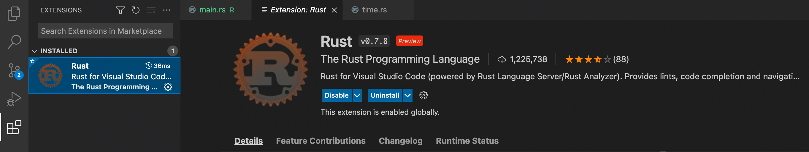
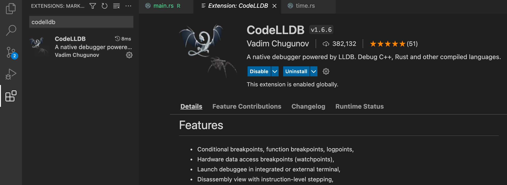
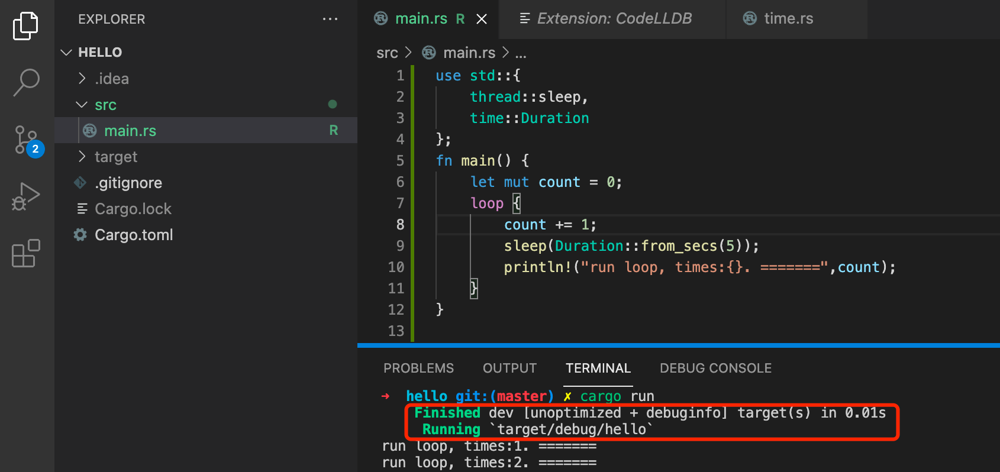
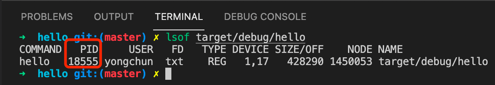
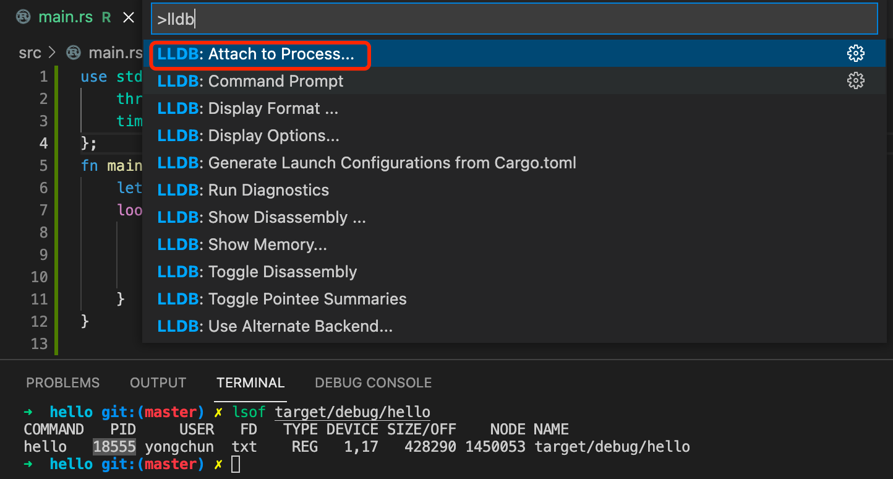
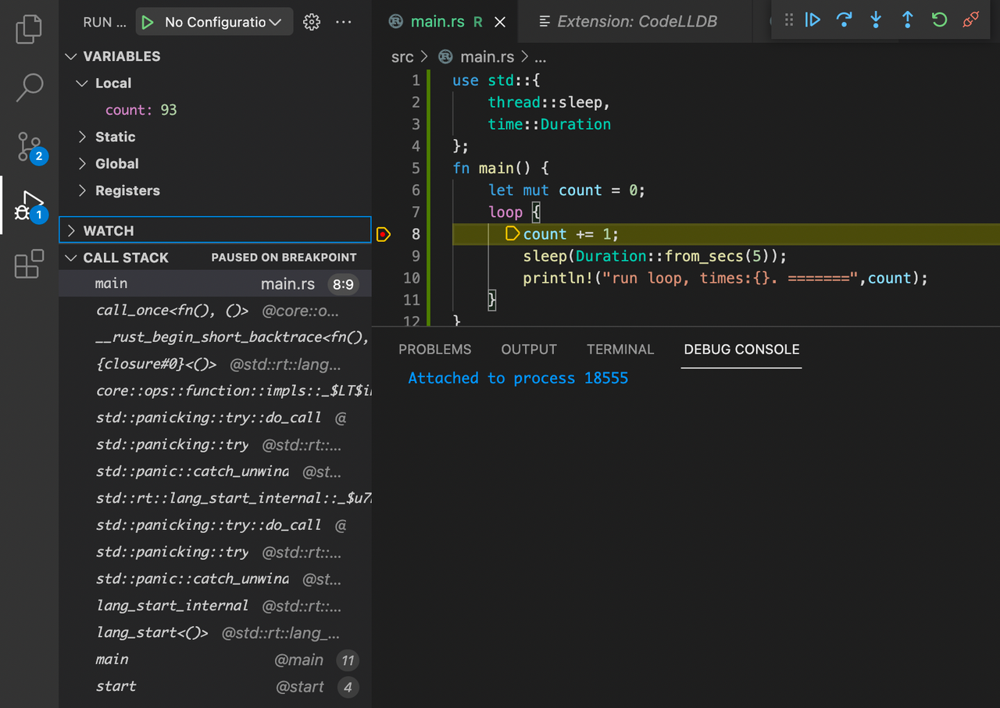

# VScode如何attach进程
## 1. 前提条件
### 安装rust插件

### 安装codelldb

## 2. 确认是debug编译模式的产物

## 3. 找到占用文件的进程ID
```shell
lsof 文件名称
```

## 4. attach进程
### 快捷键：cmd+shift+p
### 搜索"lldb",选择"Attach to Process"

### 填写进程id

### 5. 查看调用栈和变量
